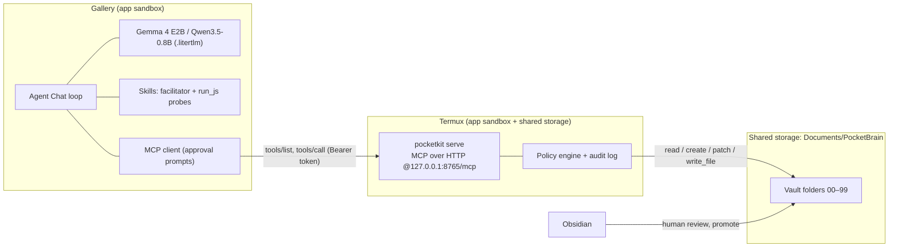
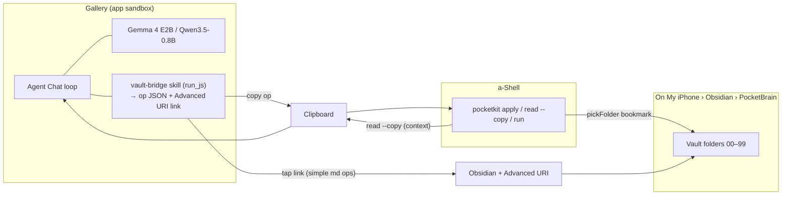

# Local AI Workshop — Design Specification

## Phase 1: "Pocket Node" — Stand-alone Smartphone System (Android + iOS)

| Field | Value |
|---|---|
| Document type | Design specification (input for a subsequent coding session) |
| Status | Draft for implementation |
| Date | 15 September 2026 |
| Scope | Phase 1: a phone-only local AI system. Phase 2 ("Desk Node", laptop) is out of scope; its interfaces are reserved in §15 |
| Deliverable | A GitHub template repository that (a) acts as the interactive workbook for a 1 h 45 min session and (b) bootstraps each participant's phone: harness, tool bridge, Obsidian vault, skills |
| Audience | Facilitator/developer building the template; participants are introductory-level with a pre-session checklist completed |

**Conventions.** MUST / SHOULD / MAY follow RFC 2119. Items tagged **[VERIFY]** depend on app versions or device behaviour and MUST be resolved in milestone M0 (§9). All are listed in the Validation Register (§16). Parity labels used throughout: **Full** (same on both OS), **Adapted** (same outcome, OS-specific path), **Android-only**, **Deferred** (Phase 2 or follow-up materials).

---

## 1. Purpose and learning goals

The session gives participants a working, private, local AI system on the phone they already own — one that goes beyond single-turn chat to **agentic loops that read, create and surgically edit files in a dedicated Obsidian vault**.

| # | Learning goal | What participants experience in Phase 1 |
|---|---|---|
| G1 | Open-weight models: types, modalities, providers, requirements | Run Gemma 4 E2B (text, image, audio input, tool calling) and contrast it with Qwen3.5-0.8B on the same agentic task |
| G2 | Hugging Face navigation | Locate both models on Hugging Face, read their cards (license, format, modalities), import the small model into the harness by URL |
| G3 | Harness bootstrapping, sandboxing | Install one agent harness, extend it with skills and a local tool bridge, understand the app sandbox and approval gates |
| G4 | Interface channels, multi-agent loops, context management, second brain | Point the agent at an Obsidian vault, run a multi-step loop that starts from an existing note, uses facilitator skills, creates drafts, edits sections, writes a script, and hands results back for human review |

---

## 2. Scope

### 2.1 In scope

- One agent harness on both platforms (§5), with OS-specific extensions where they unlock substantial capability.
- A **terminal workbench** on each OS (Termux on Android, a-Shell on iOS) running one shared, dependency-free Python toolkit (`pocketkit`).
- An **on-device MCP tool server** for the vault (Android), and an **assisted vault bridge** (iOS).
- A dedicated Obsidian vault with fixed folder rules and frontmatter schema.
- A skill pack including four facilitator skills (§7.7).
- A pre-session checklist per OS (§10), a 105-minute session plan (§11), a combined demo script (§12), and follow-up materials (§13).

### 2.2 Out of scope (Phase 2 or follow-up)

- Laptop runtimes, Docker, remote MCP servers, synced multi-device vaults.
- Live messaging bridges during the session (documented as Android follow-up, §7.9).
- Security deep-dive module (delivered as follow-up materials, §13).
- Benchmarking exercises.

---

## 3. Design principles

1. **Capability first, one harness.** Participants learn one agent harness deeply. It is chosen for the most advanced agentic features, even where one OS gets them first.
2. **Partial parity is acceptable.** The same learning outcome MUST be reachable on both OS; the path MAY differ (automatic tool calls on Android, assisted apply on iOS).
3. **Sideloading allowed where it pays off.** Android participants install Termux from F-Droid or GitHub. iOS stays App Store-only (a-Shell is in the App Store).
4. **Write once, run on both terminals.** `pocketkit` is a single Python file using only the standard library (target Python ≥ 3.11), so the same commands run in Termux and a-Shell. Optional extras MUST be pure-Python.
5. **The vault is the contract.** All agent input/output flows through Markdown (and small code files) in one vault with fixed folders and a simple schema. Policies are enforced in code, not just prompts.
6. **Humans promote, AI drafts.** AI-created files land in `10-Drafts`; only a human action moves them into curated folders and marks them reviewed.
7. **Approval by default.** Every state-changing tool call is either approved in the harness UI (Android MCP) or applied by the participant (iOS).
8. **Offline after setup.** Core session features work in airplane mode once models and tools are installed.

---

## 4. Target devices

| Item | Requirement |
|---|---|
| Reference RAM | **6 GB** (design and test target) |
| Android | Android 12+, arm64, ≥ 10 GB free storage |
| iOS | iOS 17+ (harness minimum), ≥ 10 GB free storage. 6 GB examples: iPhone 13 Pro/Pro Max, iPhone 14 series, iPhone 15/15 Plus |
| Below 6 GB | May use Qwen3.5-0.8B only; agentic demos watched on facilitator device |
| Test devices (§9.2) | One 6 GB Android phone (available); one 6 GB iPhone (to be acquired) |

---

## 5. Harness decision

### 5.1 Selected harness: Google AI Edge Gallery ("Gallery")

Gallery is the single harness for both platforms. Rationale: it is the only free, open-source phone harness that combines, in one app, Gemma 4 with image and audio input, a model-driven multi-step **Agent Skills** loop, **JavaScript code execution** (`run_js`), **native OS intents**, an **MCP client**, chat history and system instructions. Its MCP client (Streamable HTTP) currently ships on Android as an experimental feature with iOS announced to follow **[VERIFY iOS status at build time]**, and it prompts the user for approval before executing MCP tool calls.

### 5.2 Capability verification: code-execution and tool features in candidate harnesses

| Capability | Gallery Android | Gallery iOS | PocketPal AI (Android/iOS) | Evidence / status |
|---|---|---|---|---|
| Text-only skills (`SKILL.md`) | ✅ | ✅ | — (no skill system) | Gallery skills documentation; App Store listing describes Agent Skills |
| JS skills via `run_js` (hidden webview) | ✅ | ✅ expected **[VERIFY V1]** | ❌ No code-execution tool | Gallery docs describe JS skills as a cross-platform webview path; the iOS store listing advertises the bundled JS-type skills (Wikipedia lookup, maps, summary cards). PocketPal's tools ("Talents") are limited to calculate, date/time and HTML rendering |
| Native intents (send email/text, calendar, reminders) | ✅ | ✅ **[VERIFY V16]** | ❌ | Gallery release notes and skills docs |
| MCP client (Streamable HTTP) | ✅ experimental | ⏳ announced **[VERIFY V3]** | ❌ | Gallery blog/docs |
| Load skill from URL | ✅ | ✅ | — | Gallery docs |
| Import skill from local folder | ✅ (Android file picker) | **[VERIFY V14]** | — | Gallery docs |
| File system access to other apps' folders | ❌ (app sandbox) | ❌ | ❌ | Requires tool bridge (§7.3–7.5) |
| Image / audio input (Gemma 4) | ✅ | ✅ | Image via projector (varies) | Gallery feature tiles |

**Conclusion:** `run_js` is a usable programming tool in Gallery on Android and is expected to work on iOS (must be confirmed on the iPhone test device with the `quant-calculator` probe skill, §7.7). PocketPal has no general code-execution tool and is not used.

### 5.3 Supporting components (not harnesses)

| Component | Android | iOS | Role |
|---|---|---|---|
| Terminal workbench | **Termux** (F-Droid or GitHub release) | **a-Shell** (App Store) | Runs `pocketkit`: vault setup, file ops, PDF extraction, chunking, MCP server (Android), apply ops (iOS), running generated scripts |
| Knowledge base | **Obsidian** | **Obsidian** + **Advanced URI** community plugin | Dedicated vault `PocketBrain` |
| Automation glue | — | **Apple Shortcuts** (optional) | One-tap "apply clipboard ops" |

Why these terminals: Termux provides a full Linux userland with Python and shared-storage access. a-Shell provides `python3` (pure-Python `pip`), can open folders inside other apps' sandboxes via `pickFolder` and bookmark them, and exposes Shortcuts actions (Execute Command, Put File, Get File). iSH (x86 emulation, slow), Pyto and Scriptable (no Python/Termux command parity) are not selected.

---

## 6. System architecture

### 6.1 Android ("Full agent" path)



### 6.2 iOS ("Assisted agent" path)



### 6.3 Layers

| Layer | Android | iOS |
|---|---|---|
| L0 OS sandbox | Per-app sandbox; Termux granted shared-storage access | Per-app sandbox; a-Shell granted folder access via `pickFolder` |
| L1 Runtime | LiteRT-LM inside Gallery | LiteRT-LM inside Gallery |
| L2 Models | Gemma 4 E2B-it; Qwen3.5-0.8B | Same |
| L3 Harness | Gallery Agent Chat + skills + MCP | Gallery Agent Chat + skills |
| L4 Tool bridge | `pocketkit serve` (MCP) | `vault-bridge` skill + `pocketkit apply` / Advanced URI |
| L5 Knowledge | Obsidian vault `PocketBrain` | Same |
| L6 Workbook | GitHub template repo + GitHub Pages | Same |

---

## 7. Component specifications

### 7.1 Models

| Role | Model | Format / source | Approx. size | Inputs | License |
|---|---|---|---|---|---|
| **Default agent model** | Gemma 4 E2B-it | `.litertlm`, Gallery catalog (Hugging Face `litert-community`) | ~2.6 GB | Text, image, audio; function calling; thinking mode | Apache 2.0 |
| **Contrast model** | Qwen3.5-0.8B | `.litertlm`, `huggingface.co/litert-community/Qwen3.5-0.8B`, imported by URL | **[VERIFY V10]** | Text | Apache 2.0 |

Teaching contrast (G1): same prompt, same skills, same tools → observe differences in instruction following, tool-call reliability and speed. Gemma 4 E2B keeps large embedding tables memory-mapped in LiteRT-LM, which is why a ~2.6 GB model runs within a 6 GB phone's working memory.

Content notes:
- Gemma 4 received an upstream checkpoint/template refresh in mid-2026; the pre-session checklist MUST point to current catalog entries **[VERIFY]**.
- Importing from Hugging Face in Gallery requires a free Hugging Face account login.
- Larger 2026 families (e.g., Qwen3.8-27B) are named only as "Desk Node" examples.

### 7.2 Harness configuration — Gallery

| Setting / feature | Configuration |
|---|---|
| Use case | **Agent Chat** (Agent Skills) as the main surface; Ask Image and Audio Scribe as input helpers |
| Model | Gemma 4 E2B-it; Qwen3.5-0.8B for the contrast step |
| Accelerator | GPU if offered; CPU fallback |
| Thinking mode | Off by default (latency); on only when asked |
| System instructions | Paste `99-Templates/agent-system-instruction.md` from the vault (§7.6.5) |
| Skills | Load the workshop pack by URL (both OS) or from vault folder (Android) |
| MCP (Android) | Add server `http://127.0.0.1:8765/mcp` with header `Authorization: Bearer <token>`; keep approval prompts on (do not choose "Always allow" during the session) |
| Native intents | Enabled (send email/text used as outbound messaging demo) |
| Network skills | Built-in network-using skills (e.g., Wikipedia) disabled while vault tools are active |

### 7.3 Workbench toolkit — `pocketkit`

**Packaging:** single file `pocketkit/pk.py`, standard library only, Python ≥ 3.11. Optional: `pypdf` (pure Python) for PDF extraction. Invoked as `python3 pk.py <command>` (alias `pk`).

**Configuration:** `~/.pocketkit/config.json`

```json
{
  "vault": "/data/data/com.termux/files/home/storage/shared/Documents/PocketBrain",
  "vault_name": "PocketBrain",
  "default_model": "gemma-4-e2b-it",
  "server": { "host": "127.0.0.1", "port": 8765, "token": "<generated>" },
  "limits": { "read_chars": 4000, "run_timeout_s": 20 },
  "allow_run": false
}
```

**Commands**

| Command | Purpose | Android | iOS |
|---|---|---|---|
| `pk doctor` | Check Python version, vault path, write access, optional `pypdf`, clipboard support, port | ✅ | ✅ |
| `pk init --vault PATH` | Write config, create missing folders, copy starter notes non-destructively, generate token, create `.pocketkit/` | ✅ | ✅ (`--vault .` after `jump PocketBrain`) |
| `pk map` | Regenerate the "Vault map" section of the vault `README.md` (folders, rules, recent notes) | ✅ | ✅ |
| `pk ls [FOLDER]` · `pk read PATH [--heading H] [--copy]` · `pk search QUERY` | Browse and reference context; `--copy` puts output on the clipboard | ✅ | ✅ |
| `pk new --type idea --title T` | Create a **human** note in `00-Inbox` with schema | ✅ | ✅ |
| `pk apply [FILE \| - \| --clipboard]` | Validate and apply AI op batches (§7.5.1) under the policy engine | ✅ | ✅ |
| `pk promote PATH --to FOLDER` | **Human** review step: move from `10-Drafts` to `20–50` folder, set `status: reviewed` | ✅ | ✅ |
| `pk extract FILE.pdf` | PDF → Markdown note in `00-Inbox` (`type: source`, `status: draft`) | ✅ | ✅ **[VERIFY V18]** |
| `pk chunk PATH --words 1200` | Split long sources/transcripts into numbered notes for small context windows | ✅ | ✅ |
| `pk run PATH` | Run a vault Python script (from `10-Drafts` or `50-Skills`) with timeout, cwd inside `.pocketkit/run/` | ✅ | ✅ |
| `pk serve` | Start MCP server (§7.4) | ✅ | Not used (iOS suspends background apps) |
| `pk log [-n 20]` | Show audit log tail | ✅ | ✅ |
| `pk telegram` | Messaging bridge (follow-up, §7.9) | Android-only | — |

Clipboard backends: Android `termux-clipboard-get/set` (requires the Termux:API add-on from the same source as Termux); iOS `pbpaste/pbcopy` **[VERIFY V6]**. Fallback everywhere: `pk apply -` then paste and end with Ctrl-D.

**Policy engine (shared by `serve`, `apply` and mirrored in the `vault-bridge` skill)**

| Rule | Behaviour |
|---|---|
| P1 Vault jail | Resolve all paths inside the vault root; reject `..`, absolute paths, symlinks leaving the vault, and `.obsidian/` |
| P2 AI creates in drafts | Every AI `create`/`write_file` is placed under `10-Drafts/` (paths outside are rewritten to `10-Drafts/<basename>`) |
| P3 AI edit scope | AI `patch`/`frontmatter` allowed only in `00-Inbox`, `10-Drafts`, `30-Tasks`; any AI edit sets `status: draft` |
| P4 Read-only for AI | `20-Sources`, `40-Personas`, `50-Skills`, `99-Templates` are read-only to AI ops (change via a draft + human `promote`) |
| P5 Schema enforcement | AI-created notes get frontmatter `source: ai`, `status: draft`, `created`, `model` |
| P6 Script safety | `write_file` limited to `.md .py .js .html .csv .json .txt`; `run_script` over MCP exists only if `allow_run: true`, Python only, timeout, no network guarantee (see §7.10) |
| P7 Audit | Every op appends a JSON line to `.pocketkit/audit.jsonl` (time, tool, path, bytes, result) |
| P8 Size limits | Reads truncated to `read_chars` with continuation offset; writes capped (e.g., 64 KB) |

### 7.4 On-device MCP server (Android)

**Transport:** Streamable HTTP, single endpoint `POST /mcp`, JSON responses (no SSE streaming required), stateless. `GET /mcp` returns 405. Bind `127.0.0.1` only. Require `Authorization: Bearer <token>`.

**Lifecycle methods:** `initialize` (negotiate protocol version: echo the client's version if it is one of `2025-03-26`, `2025-06-18`, `2025-11-25`, otherwise return the newest supported), `notifications/initialized` (202, no body), `ping`, `tools/list`, `tools/call`. The `initialize` result includes an `instructions` string containing the vault rules (P2–P4) and the folder map.

**Tools**

| Tool | Arguments | Result |
|---|---|---|
| `vault_guide` | — | Folder map, rules, schema, recent notes |
| `vault_list` | `folder?`, `pattern?` | Paths with type/status |
| `vault_read` | `path`, `heading?`, `offset?` | Text (truncated with next offset) |
| `vault_search` | `query`, `folder?` | Up to 10 `path:line: snippet` hits |
| `vault_create` | `title`, `type` (idea/task/source/persona/skill), `content`, `tags?` | Created path in `10-Drafts` |
| `vault_patch` | `path`, `mode` (`replace_section`/`append_section`/`prepend_section`/`replace_text`), `heading?`, `find?`, `content` | Diff summary |
| `vault_frontmatter` | `path`, `set` (object; schema keys only) | Updated frontmatter |
| `file_write` | `path`, `content` | Written path in `10-Drafts` (non-Markdown allowed per P6) |
| `run_script` (only if `allow_run`) | `path` | stdout/stderr (truncated), exit code |

Section semantics for `vault_patch`: a section is a Markdown heading line and everything until the next heading of the same or higher level. `replace_text` requires `find` to match exactly once.

**Example exchange**

```http
POST /mcp HTTP/1.1
Authorization: Bearer 7f3c…
Content-Type: application/json
Accept: application/json, text/event-stream

{"jsonrpc":"2.0","id":7,"method":"tools/call",
 "params":{"name":"vault_patch","arguments":{
   "path":"10-Drafts/session-outline-lunch-and-learn.md",
   "mode":"replace_section","heading":"## Outline",
   "content":"| # | Start | End | … |"}}}
```

```json
{"jsonrpc":"2.0","id":7,"result":{
  "content":[{"type":"text","text":"Replaced section '## Outline' (18 lines → 20 lines). status set to draft."}],
  "isError":false}}
```

**Operating notes (Android)**
- Start with `pk serve` in Termux, then `termux-wake-lock`; exempt Termux from battery optimisation so the server survives while Gallery is in the foreground **[VERIFY V4]**.
- If Gallery rejects a loopback `http://` URL (its docs describe connecting to servers via a publicly routable URL) **[VERIFY V2]**, fall back in this order: (1) Android uses the iOS assisted path (§7.5); (2) optional: an HTTPS quick tunnel from Termux with the bearer token — requires internet and exposes an endpoint publicly, so it is not used in the session.

### 7.5 iOS assisted vault bridge

#### 7.5.1 Op batch format (shared by `pk apply`, `vault-bridge`, MCP semantics)

```json
{
  "pk": 1,
  "model": "gemma-4-e2b-it",
  "ops": [
    {"op": "create", "title": "Session outline – Lunch & Learn", "type": "task",
     "content": "## Outline\n| # | Start | End | … |"},
    {"op": "patch", "path": "10-Drafts/session-outline-lunch-and-learn.md",
     "mode": "replace_section", "heading": "## Outline", "content": "…"},
    {"op": "frontmatter", "path": "10-Drafts/session-outline-lunch-and-learn.md",
     "set": {"tags": ["lunch-and-learn"]}},
    {"op": "write_file", "path": "10-Drafts/runsheet/make_runsheet.py", "content": "…"}
  ]
}
```

`pk apply` prints a dry-run summary and asks for `y` before writing (flag `--yes` to skip).

#### 7.5.2 Two application routes

| Route | Use for | How |
|---|---|---|
| **A. a-Shell apply** (default) | Any op incl. code files, multi-op batches | Tap "Copy" in the skill output → switch to a-Shell → `pk apply --clipboard` → `y` |
| **B. Advanced URI link** | Single Markdown create/append/prepend/overwrite at a heading | Tap the generated `obsidian://adv-uri?...` link **[VERIFY V8, V9]** |
| C. Shortcut (optional) | One-tap version of A | Shortcut "PK Apply": Get Clipboard → a-Shell *Put File* `op.json` → a-Shell *Execute Command* (run In App) `jump PocketBrain` + `pk apply $SHORTCUTS/op.json --yes` **[VERIFY V7]** |

Context back into the agent: `pk read 00-Inbox/idea-… --copy` → paste into Gallery. Results of applied ops (`pk apply` prints paths and diffs) are pasted back to continue the loop.

### 7.6 Knowledge layer — dedicated Obsidian vault `PocketBrain`

#### 7.6.1 Folder structure and routing rules

```
PocketBrain/
  README.md          ← vault guide + generated "Vault map" (pk map)
  00-Inbox/          ← every new human-created note starts here
  10-Drafts/         ← every AI-generated note/file lands here first
  20-Sources/        ← verified knowledge and reference material
  30-Tasks/          ← tasks and projects
  40-Personas/       ← persona prompts for agents
  50-Skills/         ← skills (SKILL.md folders) and reviewed scripts
  99-Templates/      ← note templates + agent system instruction
  .pocketkit/        ← audit log, run sandbox (hidden from Obsidian)
```

| Origin | Lands in | Moves to (human action) |
|---|---|---|
| Human note | `00-Inbox` | `20-Sources`, `30-Tasks`, `40-Personas`, `50-Skills` |
| AI note or file | `10-Drafts` | Same, after review (`pk promote` or manual move + `status: reviewed`) |

#### 7.6.2 Frontmatter schema

```yaml
---
type: idea        # idea | task | source | persona | skill
created: 2026-09-15T14:05
source: human     # human | ai
model: gemma-4-e2b-it   # only when source: ai
tags: []          # optional, no default values
status: draft     # draft | reviewed
---
```

Type guidance: session outlines and follow-up plans → `task`; promotional descriptions and concept notes → `idea`; extracted PDFs, transcripts, glossaries → `source`; agent prompts → `persona`; skill documentation → `skill`.

**`SKILL.md` exception:** Gallery requires `name` and `description` frontmatter. Skill files carry the vault schema keys under `metadata:` (e.g., `metadata: {type: skill, source: human, status: reviewed}`) **[VERIFY V13]**. If Gallery rejects extra keys, each skill folder gets a companion note `50-Skills/<skill>.md` holding the schema instead.

#### 7.6.3 Starter notes (in `vault-template/`)

| Path | type / source / status | Purpose |
|---|---|---|
| `README.md` | — | How the vault works; generated map |
| `00-Inbox/idea-local-ai-lunch-and-learn.md` | idea / human / draft | **Demo starting note**: rough idea for a 45-min lunch-and-learn, audience, constraints, open questions |
| `20-Sources/facilitation-principles.md` | source / human / reviewed | Short reference used by facilitator skills |
| `20-Sources/local-ai-glossary.md` | source / human / reviewed | Terms for G1 |
| `30-Tasks/workshop-prep.md` | task / human / reviewed | Example task list with checkboxes |
| `40-Personas/session-copilot.md`, `40-Personas/critic.md` | persona / human / reviewed | Persona prompts |
| `50-Skills/<skill>/SKILL.md` (+ `scripts/`) | skill (in `metadata`) | Local copies of the skill pack |
| `99-Templates/{idea,task,source,persona,skill}.md` | — | Templates |
| `99-Templates/agent-system-instruction.md` | — | Pasted into Gallery system instructions |

#### 7.6.4 Referencing and editing capabilities

| Capability | Android (MCP) | iOS (assisted) |
|---|---|---|
| Reference a note as context | `vault_read`, `vault_search`, `vault_guide` | `pk read … --copy` → paste; or copy from Obsidian |
| Full generation → new file | `vault_create`, `file_write` | `create` / `write_file` ops via `pk apply`; or Advanced URI |
| Surgical edit of a section | `vault_patch` (`replace_section`, `append_section`, …) | `patch` op via `pk apply`; Advanced URI `heading` + `mode` for append/prepend |
| Frontmatter edit | `vault_frontmatter` | `frontmatter` op |
| Human review/promotion | Obsidian + `pk promote` | Same |

#### 7.6.5 Agent system instruction (template content, abridged)

```markdown
You are a careful assistant working inside the Obsidian vault "PocketBrain".
Folders: 00-Inbox (human notes), 10-Drafts (your output), 20-Sources (verified, read-only),
30-Tasks, 40-Personas (read-only), 50-Skills (read-only), 99-Templates (read-only).
Rules: read before you write; create new files only in 10-Drafts; edit only the section you
were asked to change; keep frontmatter keys type/created/source/model/tags/status;
never invent file contents you have not read; stop after at most 6 tool calls and summarise
what you changed and what the human should review.
```

### 7.7 Skill pack

All skills live in `skills/` in the repo, are published on GitHub Pages (with `.nojekyll` so `SKILL.md` is served raw), and are mirrored into `50-Skills/`. JS skills follow Gallery's contract: `scripts/index.html` defines `window.ai_edge_gallery_get_result(data, secret)` returning a JSON string.

| Skill | Type | Network | Purpose | Used in |
|---|---|---|---|---|
| `quant-calculator` | JS | No | **`run_js` probe** + G1 size/memory estimates | Setup smoke test |
| `vault-bridge` | JS | No | Build op JSON + Advanced URI link with policy checks (primary on iOS, fallback on Android) | Demo (iOS) |
| `session-drafter` | Text-only | No | Source + design brief → session outline table | Demo |
| `session-describer` | Text-only | No | Outline/sources + bullet draft/profile → promotional description | Demo |
| `session-copilot` | Text-only | No | Live re-planning when blocks overrun or plans change | Demo |
| `post-session-follow-up` | Text-only | No | Session materials/transcript + learning goals → follow-up learning plan | Follow-up |

#### 7.7.1 `session-drafter`

```markdown
---
name: session-drafter
description: Draft a session or learning-activity outline table from source material and a short design brief (duration, participants, goals).
metadata:
  type: skill
  source: human
  status: reviewed
---
# Session drafter

## Instructions
Use when the user wants a session plan, agenda, workshop outline or learning activity plan.

1. Collect: source material (a vault note via vault_read, or pasted text), total duration,
   start time (default 00:00), number and type of participants, learning goals, format
   constraints (online/in person, materials available). If a PDF was mentioned, ask the
   user to run `pk extract` first. Ask at most one clarifying question; otherwise state assumptions.
2. Produce a Markdown table with exactly these columns:
   | # | Start | End | Duration (min) | Activity | Description | Materials | Notes |
3. Rules: durations must add up to the total; include a short opening and closing; at least
   one interactive block per 20 minutes; put assumptions and risks in Notes.
4. Below the table add "## Assumptions" and "## Open questions" (max 3 bullets each).
5. If vault tools are available, save with vault_create (type: task) using the title
   "Session outline – <topic>" and a "## Outline" heading containing the table. Otherwise call
   the vault-bridge skill with a create op.
```

#### 7.7.2 `session-describer`

Inputs: outline or sources; optional bullet-point draft description; optional target participant profile; channel (email, intranet, event page) and length.
Output (under headings, saved as `type: idea`):
- `## Title options` — 3 options (≤ 8 words).
- `## Short blurb` — ≤ 50 words.
- `## Description` — 120–180 words, benefit-led, plain language.
- `## Who it's for` — 2–3 bullets derived from the profile.
- `## You will be able to` — 3–5 outcomes starting with action verbs, each traceable to the outline.
- `## Practical details` — placeholders `[date] [time] [location] [registration link]`.
Rules: do not promise content absent from the outline; flag missing information as placeholders.

#### 7.7.3 `session-copilot`

Inputs: current outline (vault path or pasted), current clock time, what happened (overrun block and minutes, early finish, tech failure, low energy, new participant need), fixed constraints (hard end time, must-keep blocks).
Output:
- `Diagnosis` — one sentence (minutes to recover).
- `Option A` and `Option B` — each a revised table of **remaining** blocks only (same columns as drafter) plus one-line trade-off.
- `Recommendation` — A or B with reason.
- `Say to the group` — one sentence.
Rules: keep the end time unless told otherwise; never cut blocks marked must-keep; prefer compressing discussion over removing practice. With vault tools, apply the chosen option with `vault_patch` (`replace_section`, heading `## Outline`) and append a `## Change log` line.

#### 7.7.4 `post-session-follow-up`

Inputs: any of outline, description, source material, transcript (long transcripts pre-split with `pk chunk`); learner's development goals; available time per week; preferred learning modes; perspective (participant or self-guided learner, e.g., after watching a video).
Output (saved as `type: task`):
- `## Key insights` — 3–5 bullets, each tied to material provided.
- `## Follow-up plan` — table `| Week | Activity | Mode (practice/read/watch/reflect/apply) | Time (min) | Evidence of progress | Goal link |`.
- `## Retrieval questions` — 5 questions to answer without notes (spaced over the plan).
- `## Apply this week` — one micro-project with a concrete deliverable.
Rules: activities must fit the stated weekly time; prefer practice and application over consumption; suggest resource *types* when specific resources are not in the provided material.

#### 7.7.5 `quant-calculator` (run_js probe, abridged)

```html
<!doctype html><html><body><script>
window.ai_edge_gallery_get_result = async (data) => {
  try {
    const d = typeof data === "string" ? JSON.parse(data) : data;
    const fileGB = d.params_b * d.bpw / 8;
    return JSON.stringify({ result: `≈ ${fileGB.toFixed(2)} GB on disk (weights only).` });
  } catch (e) { return JSON.stringify({ error: String(e) }); }
};
</script></body></html>
```

#### 7.7.6 `vault-bridge` (behaviour)

- Input: `op`, `path?`, `title?`, `type?`, `mode?`, `heading?`, `content`.
- Applies P1–P5 client-side (e.g., rewrites creates into `10-Drafts/`, refuses writes to read-only folders).
- Returns: (1) a fenced JSON op batch for `pk apply`; (2) for single Markdown create/append/prepend/overwrite, an Advanced URI link built as `obsidian://adv-uri?vault=PocketBrain&filepath=<enc>&mode=<mode>&heading=<enc>&data=<enc>`; if the encoded link exceeds ~1,800 characters, only route A is offered **[VERIFY V9]**.

### 7.8 Agentic loop design

| Pattern | Where | Loop mechanics | Limits |
|---|---|---|---|
| **L1 Autonomous-with-approval** | Android: Gallery Agent Chat + MCP | Model plans → calls `vault_read`/`vault_search` → skill instructions → `vault_create`/`vault_patch`/`file_write` → reads result → continues; each state-changing call prompts for approval | ≤ 6 tool calls per request (system instruction); reads ≤ 4,000 chars per call |
| **L2 Assisted** | iOS: Gallery Agent Chat + `vault-bridge` + a-Shell | Model proposes op batch → human applies → human pastes result/next context → model continues | Same step budget; human is the transport |
| **L3 Code loop** | Both | Model writes script via `file_write`/op → human runs `pk run` (or MCP `run_script` if enabled on Android) → output pasted/returned → model fixes or explains | Python only, timeout 20 s, scripts stay in `10-Drafts` until promoted |
| **L4 Shortcut agent (optional, iOS follow-up)** | Apple Shortcuts + Locally AI (LM Studio) app | Repeat loop: model action returns JSON `{action, path, content}` → Shortcuts reads/saves files in the vault folder → history fed back | Not part of the session; requires iOS 18.1+ and a second model app **[VERIFY V21]** |

Multi-agent threads on the phone: persona notes in `40-Personas` (e.g., `session-copilot`, `critic`) are pasted as system instructions in separate Gallery chats; the human relays outputs between them. Automated multi-agent orchestration is Phase 2.

### 7.9 Messaging bridge options

| Option | Parity | Phase 1 status | Design |
|---|---|---|---|
| **Outbound messages via native intents** | Adapted (both OS **[VERIFY V16]**) | In session (optional step) | Agent drafts an email/text from a vault note; Gallery opens the OS composer; human sends |
| **Telegram bot on-device** | Android-only | Follow-up materials | `pk telegram`: long-polling bot (stdlib `urllib`), allow-listed chat IDs, calls a local OpenAI-compatible endpoint from llama.cpp's `llama-server` running in Termux with a GGUF model **[VERIFY V22]**; tools limited to `vault_read`, `vault_search`, `vault_create` (drafts only); requires internet and `termux-wake-lock` |
| Telegram/Matrix on iOS | — | Deferred | iOS suspends background processes; requires Phase 2 host |

### 7.10 Security baseline (session-level; full module in follow-up materials)

- Server binds loopback only and requires a bearer token; token rotates on `pk init --rotate-token`.
- Approval prompts stay on for MCP calls; iOS ops require an explicit `y` in `pk apply`.
- AI cannot modify `20-Sources`, `40-Personas`, `50-Skills`, `99-Templates` (P4).
- `run_script` is off by default; scripts run with the terminal app's permissions and are **not** network-isolated — only run scripts you have read.
- Do not enable network-using skills in the same chat where vault tools are active (never combine private vault data, untrusted content and an outbound channel in one session).
- Audit log in `.pocketkit/audit.jsonl`.

### 7.11 Workbook repository (GitHub template)

```
local-ai-workshop/
  README.md                      ← start page (phone-friendly, QR codes)
  .nojekyll
  mkdocs.yml
  docs/
    index.md
    pre-session/android.md       ← §10.1
    pre-session/ios.md           ← §10.2
    session/run-of-show.md       ← §11
    session/demo-android.md      ← §12
    session/demo-ios.md          ← §12
    follow-up/security.md
    follow-up/messaging-bridge-android.md
    follow-up/shortcut-agent-ios.md
    follow-up/post-session-follow-up.md
    troubleshooting.md
  pocketkit/
    pk.py
    tests/                       ← pytest-compatible, but runnable with unittest (stdlib)
  skills/
    quant-calculator/ vault-bridge/ session-drafter/ session-describer/
    session-copilot/ post-session-follow-up/
  vault-template/                ← §7.6
  shortcuts/
    PK-Apply.shortcut            ← exported iOS shortcut + iCloud link in docs
  .github/workflows/
    ci.yml                       ← unit tests (Python 3.11 & 3.12), skill lint, link check
    pages.yml                    ← build site, publish skills raw, attach vault-template.zip
```

CI MUST: run `pocketkit` tests including policy tests (jail, draft routing, read-only folders, section patching); validate `SKILL.md` frontmatter and JS contract presence; ensure JS skills load no remote scripts; build `vault-template.zip`.

---

## 8. Platform parity matrix

| Capability | Android | iOS | Label |
|---|---|---|---|
| Harness install (Gallery) | Play Store | App Store | Full |
| Gemma 4 E2B + Qwen3.5-0.8B in Gallery | ✅ | ✅ **[VERIFY V10, V11]** | Full |
| Image / audio input | ✅ | ✅ | Full |
| Facilitator skills (text-only) | ✅ | ✅ | Full |
| `run_js` skills | ✅ | ✅ **[VERIFY V1]** | Full |
| Terminal workbench | Termux (sideload) | a-Shell (App Store) | Adapted |
| Shared `pocketkit` commands | ✅ | ✅ (except `serve`, `telegram`) | Adapted |
| Vault access from terminal | `termux-setup-storage` → `~/storage/shared/Documents/PocketBrain` | `pickFolder` → bookmark `PocketBrain` **[VERIFY V5]** | Adapted |
| Agent reads vault notes | MCP tools (automatic) | `pk read --copy` → paste | Adapted |
| Agent creates/edits files | MCP with approval | `pk apply` / Advanced URI | Adapted |
| On-device MCP server | ✅ **[VERIFY V2, V4]** | ❌ | Android-only |
| Gallery MCP client | Experimental | Announced **[VERIFY V3]** | Android-only (now) |
| Code loop (write + run script) | ✅ | ✅ (human-run) | Adapted |
| Telegram bridge | Follow-up | ❌ | Android-only / Deferred |
| Local skill import from vault folder | ✅ | **[VERIFY V14]** | Android-only (URL import on both) |

---

## 9. Development plan

### 9.1 Milestones

| Milestone | Deliverables | Acceptance criteria |
|---|---|---|
| **M0 — Validation spike (Android now, iOS when device arrives)** | Probe skills (`quant-calculator`), minimal `pk serve` prototype, a-Shell folder-access test script, results in §16 | Android: V1, V2, V4, V10, V13 resolved. iOS items tracked as "pending device" with fallbacks documented |
| **M1 — Repo scaffold** | Template repo, Pages site, `.nojekyll`, QR codes | Site renders on phone browsers; `SKILL.md` served raw |
| **M2 — pocketkit core** | `pk.py` commands except `serve`/`telegram`; policy engine; tests | All policy tests pass on CPython 3.11/3.12 (CI) and on the Android device in Termux |
| **M3 — MCP server (Android)** | `pk serve` per §7.4; Gallery connection guide | Gallery lists tools, executes read/create/patch/write with approval on the Android test device; audit log correct |
| **M4 — Skill pack** | Six skills (§7.7); lint in CI | All skills load by URL on Android; facilitator skills produce the specified structures with Gemma 4 E2B on 3 sample briefs |
| **M5 — iOS assisted path** | `vault-bridge` routes A/B, `PK-Apply` shortcut, a-Shell install flow | Built and documented; marked "untested" until the iPhone arrives; then all iOS VERIFY items resolved |
| **M6 — Workbook content** | Pre-session checklists, run-of-show, demo scripts (both OS), follow-up materials, troubleshooting | A first-time user completes the Android pre-session checklist unaided in ≤ 45 min |
| **M7 — Facilitator solo dry run & release** | Facilitator runs the full 105-min plan alone on each available device, records timings, fixes issues; tag `v1.0` | Each block finishes within ±5 min of plan; combined demo completes end-to-end on Android (and on iOS once available) |

### 9.2 Test strategy

| Device | Available | Scope |
|---|---|---|
| Android phone, 6 GB RAM | Yes | Full: models, skills, `run_js`, Termux + pocketkit, MCP server, demo L1/L3, messaging follow-up |
| iPhone, 6 GB RAM | Not yet | Full iOS track once acquired: models, skills, `run_js`, a-Shell + pocketkit, Advanced URI, Shortcut, demo L2/L3 |

Rules: `pocketkit` logic is unit-tested in CI independent of devices; iOS-specific docs ship with an "untested on device" banner until M5 acceptance; no additional device classes are tested.

---

## 10. Pre-session checklists

Participants complete these **at home on Wi-Fi with the phone charging**. Estimated time: Android ~40 min, iOS ~30 min (mostly downloads).

### 10.1 Android

1. **Check your phone.** *Settings › About phone*: Android 12 or newer and 6 GB RAM or more. *Settings › Storage*: at least 10 GB free.
2. **Create a free Hugging Face account** (needed to import the small model): https://huggingface.co/join
3. **Install Google AI Edge Gallery** from Google Play: https://play.google.com/store/apps/details?id=com.google.ai.edge.gallery
4. **Install Obsidian** from Google Play: https://play.google.com/store/apps/details?id=md.obsidian
5. **Install Termux (not from Google Play):**
   - Open https://f-droid.org/packages/com.termux/ and tap *Download APK* (or use https://github.com/termux/termux-app/releases/latest and download the `arm64-v8a` APK).
   - Allow your browser to install unknown apps when asked, then install.
   - Optional (for clipboard support): install **Termux:API** from the *same* source.
6. **Prepare Termux.** Open Termux and type, one line at a time:
   ```bash
   pkg update && pkg upgrade -y
   pkg install -y python git
   termux-setup-storage          # tap "Allow"
   git clone https://github.com/<org>/<repo> ~/workshop
   echo "alias pk='python3 ~/workshop/pocketkit/pk.py'" >> ~/.bashrc && source ~/.bashrc
   pk doctor
   ```
   Then: *Settings › Apps › Termux › Battery › Unrestricted*.
7. **Create the vault.** Open Obsidian › *Create new vault* › name **`PocketBrain`** › location *Documents* (internal storage) › Create.
8. **Download Gemma 4 E2B.** Open Gallery › *Agent Skills* (or *AI Chat*) › choose **Gemma-4-E2B-it** › Download (≈ 2.6 GB). Keep the app open until done.
9. **Import Qwen3.5-0.8B.** Gallery › model manager › **+** › *Import from HF* › paste `https://huggingface.co/litert-community/Qwen3.5-0.8B` › sign in to Hugging Face › Download **[VERIFY V10]**.
10. **Quick test (airplane mode).** Turn on airplane mode, ask Gemma 4 E2B "Say hello in five words", then turn airplane mode off.
11. **Done.** Bring the phone charged plus a cable or power bank.

### 10.2 iOS

1. **Check your iPhone.** *Settings › General › About*: iOS 17 or newer. *Settings › General › iPhone Storage*: at least 10 GB free. 6 GB models include iPhone 13 Pro/Pro Max, iPhone 14 series and iPhone 15/15 Plus.
2. **Create a free Hugging Face account:** https://huggingface.co/join
3. **Install Google AI Edge Gallery:** https://apps.apple.com/us/app/google-ai-edge-gallery/id6749645337
4. **Install Obsidian** (App Store, publisher Dynalist Inc.): https://apps.apple.com/app/obsidian-connected-notes/id1557175442 **[VERIFY V19]**
5. **Install a-Shell** (App Store, free): https://apps.apple.com/app/a-shell/id1473805438 **[VERIFY V19]**
6. **Make sure the Shortcuts app is installed** (pre-installed; reinstall from the App Store if removed).
7. **Create the vault.** Obsidian › *Create new vault* › name **`PocketBrain`** › keep *On My iPhone* › Create.
8. **Install Advanced URI.** Obsidian › *Settings › Community plugins* › *Turn on community plugins* › *Browse* › search **Advanced URI** (https://community.obsidian.md/plugins/obsidian-advanced-uri) › Install › Enable.
9. **Prepare a-Shell.** Open a-Shell and type, one line at a time:
   ```bash
   pickFolder                     # choose On My iPhone › Obsidian › PocketBrain
   cd ~/Documents
   curl -L -o workshop.tar.gz https://github.com/<org>/<repo>/archive/refs/heads/main.tar.gz
   tar -xzf workshop.tar.gz && mv <repo>-main workshop
   echo "alias pk='python3 ~/Documents/workshop/pocketkit/pk.py'" >> ~/.profile
   pip install pypdf
   ```
   Close and reopen a-Shell, then run `pk doctor` **[VERIFY V5, V7, V18]**.
10. **Add the "PK Apply" shortcut** (optional): open the iCloud link on the workbook page `pre-session/ios`, tap *Add Shortcut*.
11. **Download Gemma 4 E2B** in Gallery (≈ 2.6 GB) and **import Qwen3.5-0.8B** by URL as in Android step 9 **[VERIFY V10, V11]**. Keep Gallery open and the phone plugged in during downloads.
12. **Quick test (airplane mode)** as in Android step 10.
13. **Done.** Bring the phone charged plus a cable or power bank.

---

## 11. Session plan (105 minutes, no breaks)

| Clock | Min | Block | Content | Checkpoint |
|---|---|---|---|---|
| 0:00 | 5 | Welcome & readiness | Goals, show-of-hands on checklist, pair Android/iOS participants, facilitator phone mirrored | Everyone has Gallery + both models |
| 0:05 | 10 | Models & Hugging Face orientation (G1, G2) | Open both model pages on Hugging Face: license, format (`.litertlm`), modalities, size; why E2B fits 6 GB; where Qwen3.5-0.8B came from | Participants can state format, license, modalities of each model |
| 0:15 | 20 | **Build 1: Dedicated vault pointed at the agent** (§11.1) | Vault template install, terminal access to vault, `pk init`, `pk map`, system instruction | `pk doctor` all green; `README.md` shows vault map |
| 0:35 | 25 | **Build 2: Harness wiring** (§11.2) | Load skill pack; Android: start MCP server + connect; iOS: vault-bridge + apply route | Android: Gallery lists vault tools. iOS: test op applied |
| 1:00 | 10 | **Build 3: Smoke tests** (§11.3) | `run_js` probe, read a note, create a draft, patch a section | One test draft exists in `10-Drafts` |
| 1:10 | 30 | **Combined demo: from idea note to session pack** (§12) | Agentic loop across skills, tools, image/audio input, code, model contrast, human review | Outline, description, run-sheet script and promoted note in vault |
| 1:40 | 5 | Close | What was built; follow-up materials (security, messaging bridge, iOS Shortcut agent, post-session follow-up skill); Phase 2 preview | Follow-up link shared |

### 11.1 Build 1 — Establish the dedicated vault (20 min)

| Step | Android (Termux) | iOS (a-Shell) |
|---|---|---|
| 1. Confirm empty vault exists | Obsidian shows `PocketBrain` | Same |
| 2. Point toolkit at vault | `pk init --vault ~/storage/shared/Documents/PocketBrain` | `jump PocketBrain` then `pk init --vault .` |
| 3. Install starter structure | (done by `init`: folders 00–99 + starter notes) | Same |
| 4. Generate vault map | `pk map` | Same |
| 5. Verify in Obsidian | Reopen vault; folders and `00-Inbox/idea-local-ai-lunch-and-learn.md` visible | Same |
| 6. Try referencing | `pk read 00-Inbox/idea-local-ai-lunch-and-learn.md` | `pk read … --copy` |
| 7. Point the model | Gallery › Agent Chat › system instructions › paste `99-Templates/agent-system-instruction.md` (copy from Obsidian) | Same |
| 8. Human note routing | `pk new --type idea --title "My first idea"` → appears in `00-Inbox` | Same |

### 11.2 Build 2 — Harness wiring (25 min)

**Both OS**
1. Gallery › Agent Skills › Skills › **+** › *Add from URL* for each: `https://<org>.github.io/<repo>/skills/<skill-name>/` (QR code sheet on screen) **[VERIFY V15: directory URL vs `SKILL.md` URL]**.
2. Enable: `quant-calculator`, `session-drafter`, `session-describer`, `session-copilot`, and on iOS `vault-bridge`. Disable built-in network skills.

**Android**
3. Termux: `pk serve` → note printed URL and token → `termux-wake-lock`.
4. Gallery › Agent Chat › **MCP** › *Add MCP server* › URL `http://127.0.0.1:8765/mcp` › header `Authorization: Bearer <token>` › Save.
5. Confirm the tool list shows `vault_guide … file_write`.

**iOS**
3. Confirm Advanced URI is enabled in Obsidian.
4. Optional: run the *PK Apply* shortcut once to grant a-Shell permissions.

### 11.3 Build 3 — Smoke tests (10 min)

| # | Prompt / action | Expected (Android) | Expected (iOS) |
|---|---|---|---|
| S1 | "Use the quant calculator for 2 billion parameters at 4.8 bits." | `run_js` result shown | Same **[VERIFY V1]** |
| S2 | "Read the vault guide and list the folders." | `vault_guide` call, correct list | Paste `pk read README.md --copy`; model lists folders |
| S3 | "Create a draft note titled 'Smoke test' with one sentence." | Approval → file in `10-Drafts` with `source: ai` | vault-bridge op → `pk apply --clipboard` → file in `10-Drafts` |
| S4 | "In 'Smoke test', append a section '## Check' with the word ok." | `vault_patch` approval → section added | Advanced URI link (route B) or `pk apply` |

---

## 12. Combined demo block — "From idea note to session pack" (30 min)

Starting note: `00-Inbox/idea-local-ai-lunch-and-learn.md` (human idea: 45-minute lunch-and-learn on local AI for ~15 library staff, mixed digital confidence, wants hands-on and a follow-up).

| # | Min | Capability shown | Prompt / action (Android: automatic tools; iOS: apply ops via route A/B) |
|---|---|---|---|
| D1 | 3 | **Audio input** | Audio Scribe: record ~20 s: "Room has no projector; half the group uses iPhones; end by 13:00." → copy transcript |
| D2 | 2 | **Image input** (optional) | Ask Image: photo of a handwritten flipchart agenda → "Extract the agenda as bullets." → copy |
| D3 | 6 | **Agentic loop + context + full generation** | Agent Chat (Gemma 4 E2B): "Read 00-Inbox/idea-local-ai-lunch-and-learn.md. Using the session-drafter skill and these extra constraints: <paste D1/D2>, create a session outline starting 12:15." Expected: read → draft table → create `10-Drafts/session-outline-…md` (`type: task`) |
| D4 | 4 | **Surgical edit + live co-pilot** | "It's 12:40 and the hands-on block overran by 8 minutes. Use session-copilot, recommend an option and update only the Outline section." Expected: two options → `vault_patch replace_section ## Outline` + `## Change log` |
| D5 | 4 | **Second artifact** | "Using session-describer, write an intranet description for this outline." → new draft (`type: idea`) |
| D6 | 5 | **Code loop** | "Write a Python script that reads the outline table from the draft and writes runsheet.csv with start, end, activity." → `file_write 10-Drafts/runsheet/make_runsheet.py` → participant runs `pk run 10-Drafts/runsheet/make_runsheet.py` → paste output/errors back if needed |
| D7 | 3 | **Model contrast (G1)** | Switch to Qwen3.5-0.8B, repeat D3 prompt in a new chat. Observe: missing/malformed tool calls, weaker table, speed. Discuss why tool use needs a capable model |
| D8 | 3 | **Human review & promotion** | Open Obsidian: inspect drafts, fix one line, then `pk promote 10-Drafts/session-outline-….md --to 30-Tasks` and `pk promote 10-Drafts/<description>.md --to 20-Sources`; show `pk log` |
| — | (opt.) | **Outbound message** | "Draft an email to my manager summarising the plan" → native email intent opens composer (not sent) |

Facilitator guidance:
- Run each step first on the mirrored phone; participants follow. iOS participants aim for D1, D3, D4, D8 (D5–D7 if time allows).
- If a tool call fails, rephrase with the explicit tool name ("Use vault_read on …") — this is itself a teaching point about small-model tool reliability.
- If Android MCP fails live, switch that participant to the iOS assisted route (works on Android too).

---

## 13. Follow-up materials (not delivered live)

| Material | Content |
|---|---|
| `follow-up/security.md` | Threat model on phones, prompt injection via notes/images, approval gates, why structured tool calls are not a safety guarantee, token handling, reading scripts before running, not mixing vault tools with network skills |
| `follow-up/messaging-bridge-android.md` | `pk telegram` + llama.cpp `llama-server` in Termux, allow-lists, wake lock, limits |
| `follow-up/shortcut-agent-ios.md` | Loop pattern L4 with Locally AI + Shortcuts file actions |
| `follow-up/post-session-follow-up.md` | Using the `post-session-follow-up` skill on the session materials or on a video transcript (`pk extract`/`pk chunk` workflow) |
| `follow-up/hugging-face.md` | Finding other `.litertlm` models, reading model cards, licenses |

---

## 14. Troubleshooting

| Symptom | Likely cause | Fix |
|---|---|---|
| Gallery cannot connect to `127.0.0.1:8765` | Server stopped (Termux backgrounded) or loopback HTTP not accepted | Re-run `pk serve`, `termux-wake-lock`, battery unrestricted; if still failing use assisted route |
| `Permission denied` on vault path (Android) | Storage permission missing | `termux-setup-storage`, then retry `pk doctor` |
| a-Shell cannot see vault | Bookmark lost / wrong folder picked | `pickFolder` again → On My iPhone › Obsidian › PocketBrain; `showmarks` |
| `pk apply --clipboard` empty | Clipboard backend unavailable | `pk apply -`, paste, Ctrl-D |
| Advanced URI link does nothing | Plugin disabled, vault name mismatch, link too long, or link not openable from skill output | Enable plugin; vault named exactly `PocketBrain`; use route A |
| Model ignores tools / loops | Context too long or small model | New chat; shorter prompt; name the tool explicitly; use Gemma 4 E2B |
| App closes during load | Memory pressure | Close other apps; restart phone; CPU/GPU toggle |
| Draft created outside `10-Drafts` | — (policy prevents) | Check `pk log`; report bug |

---

## 15. Phase 2 interface contract (reserved)

| ID | Interface | Phase 1 artifact | Phase 2 use |
|---|---|---|---|
| I1 | Vault schema & folders | `PocketBrain` structure, frontmatter, policy P1–P8 | Laptop agents read/write the same vault via sync, same policy |
| I2 | Tool API | `pocketkit` MCP tool names and semantics (§7.4) | Same server runs on the laptop; iOS Gallery connects when MCP ships on iOS |
| I3 | Op batch format | `pk` op JSON v1 (§7.5.1) | Accepted by laptop tooling for offline/async edits |
| I4 | Skills | `SKILL.md` pack incl. facilitator skills | Reused by laptop agents |
| I5 | Personas | `40-Personas/*.md` | System prompts for automated multi-agent loops |
| I6 | Models | Gemma 4 / Qwen families | Larger siblings served from the laptop |
| I7 | Messaging | `pk telegram` design | Always-on bridge hosted on the laptop |

Constraints: do not rename folders, frontmatter keys, tool names or op fields after `v1.0` without a version bump (`pk: 2`).

---

## 16. Validation register

| # | Item | Device | Fallback if false |
|---|---|---|---|
| V1 | `run_js` skills execute in Gallery (quant-calculator probe) | Android ✔ test now; iPhone pending | iOS: text-only skills; vault-bridge replaced by a text-only skill emitting op JSON |
| V2 | Gallery MCP accepts `http://127.0.0.1:8765/mcp` with custom header | Android | Assisted route on Android; optional HTTPS tunnel (follow-up only) |
| V3 | Gallery MCP availability on iOS | iPhone | Assisted route remains |
| V4 | `pk serve` survives in Termux while Gallery is foreground for 30+ min | Android | Wake lock + battery unrestricted; restart instructions |
| V5 | a-Shell `pickFolder` grants persistent read/write to `On My iPhone/Obsidian/PocketBrain` | iPhone | Vault in a-Shell's Documents opened in Obsidian via "Open folder as vault" if supported; else manual copy |
| V6 | `pbpaste`/`pbcopy` in a-Shell; `termux-clipboard-*` in Termux | Both | `pk apply -` manual paste |
| V7 | a-Shell `curl` + `tar -xzf`; Shortcuts Put File/Execute Command reach bookmarked folder in App mode | iPhone | Download zip via Safari into a-Shell folder |
| V8 | Tapping `obsidian://adv-uri` links from Gallery skill output opens Obsidian | iPhone (and Android) | Route A only |
| V9 | Advanced URI parameters for create/overwrite/append at heading; practical URL length | iPhone | Route A only |
| V10 | Qwen3.5-0.8B `.litertlm` import by HF URL works; size | Both | Qwen3-0.6B from `litert-community` |
| V11 | Gemma 4 E2B offered and runs on a 6 GB iPhone in Gallery | iPhone | Qwen3.5-0.8B for loop; Gemma via facilitator phone |
| V12 | Agent Chat usable context for tool loops (tool results + instructions) | Both | Lower `read_chars`; fewer steps |
| V13 | Gallery accepts `metadata:` schema keys in `SKILL.md` | Android | Companion notes in `50-Skills/` |
| V14 | Local skill folder import on iOS | iPhone | URL import only |
| V15 | Exact URL form for "Add from URL" (directory vs file) | Android | Adjust docs/QR codes |
| V16 | Native email/text intents available on iOS Gallery | iPhone | Copy text into Mail manually |
| V17 | Agent Chat accepts image/audio attachments directly | Both | Keep Ask Image/Audio Scribe as separate input steps (current plan) |
| V18 | `pip install pypdf` works in a-Shell and Termux | Both | Termux: `pkg install poppler` (`pdftotext`); iOS: copy text from PDF viewer |
| V19 | App Store links for Obsidian and a-Shell | iPhone | Search by name in App Store |
| V20 | Gemma 4 E2B catalog name and current checkpoint in Gallery | Both | Update checklist wording |
| V21 | Locally AI Shortcuts action parameters; Gemma 4 availability on 6 GB iPhone (follow-up L4) | iPhone | Drop L4 follow-up |
| V22 | llama.cpp availability/performance in Termux with a small GGUF (follow-up messaging) | Android | Bridge limited to Qwen-class GGUF or deferred to Phase 2 |

---

## 17. References

- Google AI Edge Gallery — repository, skills and MCP docs: `github.com/google-ai-edge/gallery`
- Google Developers Blog — Gemma 4 agentic skills at the edge; Gallery MCP integration (2026)
- LiteRT-LM — `github.com/google-ai-edge/LiteRT-LM`; `ai.google.dev/edge/litert-lm/overview`
- Gemma 4 model cards — `huggingface.co/google/gemma-4-E2B-it`; LiteRT builds in `huggingface.co/litert-community`
- Qwen3.5-0.8B LiteRT build — `huggingface.co/litert-community/Qwen3.5-0.8B`
- Termux — `github.com/termux/termux-app` (installation sources)
- a-Shell — `github.com/holzschu/a-shell` (pickFolder, bookmarks, Shortcuts actions, pure-Python pip)
- Obsidian Advanced URI — `vinzent03.github.io/obsidian-advanced-uri`
- Model Context Protocol specification — `modelcontextprotocol.io`
- Locally AI by LM Studio — `locallyai.app`
